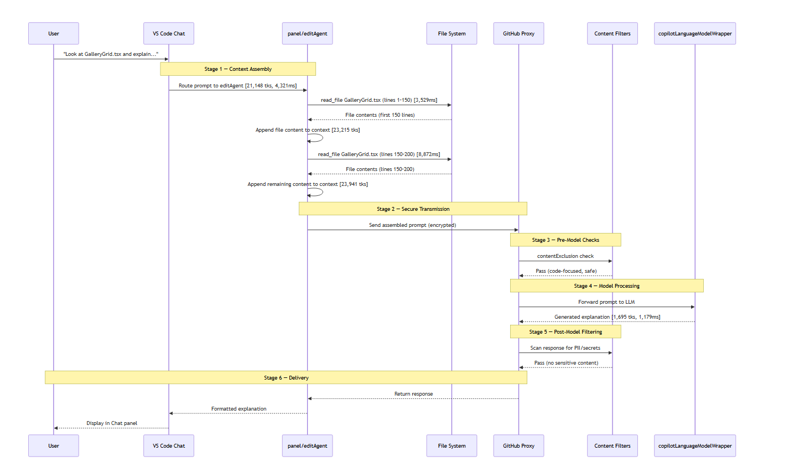

# Engineering Practices Demo

Welcome to the GitHub Copilot engineering practices demo! In this session, we go deeper into how Copilot actually works and how to use it strategically. You'll learn about data flows, context engineering, and prompt engineering—the three pillars of effective AI-assisted development.

## Table of Contents

*   [What You'll Learn](#what-youll-learn)
*   [Part 1: Understanding How Copilot Works](#part-1-understanding-how-copilot-works)
    *   [Step 1: How GitHub Copilot Fulfills a Request](#step-1-how-github-copilot-fulfills-a-request)
    *   [Step 2: Semantic Indexing - Meaning Over Keywords](#step-2-semantic-indexing---meaning-over-keywords)
*   [Part 2: Context Engineering](#part-2-context-engineering)
    *   [Step 3: Context Engineering Basics](#step-3-context-engineering-basics)
    *   [Step 4: Context Engineering Best Practices](#step-4-context-engineering-best-practices)
    *   [Step 5: Content Exclusions with .copilotignore](#step-5-content-exclusions-with-copilotignore)
    *   [Step 6: The Context Gathering Formula](#step-6-the-context-gathering-formula)
*   [Part 3: Debugging and Collaboration](#part-3-debugging-and-collaboration)
    *   [Step 7: Inspect Copilot's Decision Process with Debug View](#step-7-inspect-copilots-decision-process-with-debug-view)
    *   [Step 8: Share Chat Conversations with Your Team](#step-8-share-chat-conversations-with-your-team)
*   [Part 4: Prompt Engineering Techniques](#part-4-prompt-engineering-techniques)
    *   [Step 10: Prompt Engineering Techniques Overview](#step-10-prompt-engineering-techniques-overview)
    *   [Step 11: Few-Shot Prompting (Learning by Example)](#step-11-few-shot-prompting-learning-by-example)
    *   [Step 12: Chain of Thought (Step-by-Step Reasoning)](#step-12-chain-of-thought-step-by-step-reasoning)
    *   [Step 13: Retrieval Augmented Generation (RAG)](#step-13-retrieval-augmented-generation-rag)
    *   [Step 14: Step-Back Prompting (Zoom Out, Then Dive In)](#step-14-step-back-prompting-zoom-out-then-dive-in)
    *   [Prompt Engineering Techniques Summary](#prompt-engineering-techniques-summary)
*   [✅ Completion Checklist](#completion-checklist)
*   [🎓 Key Takeaways](#key-takeaways)
*   [🚀 What's Next?](#whats-next)

---

## What You'll Learn

By the end of this demo, you will:

*   Understand how Copilot processes requests from input to suggestion
*   Know how semantic indexing enables meaning-based code search
*   Master context engineering in Agent mode and multi-file workflows
*   Work with terminal and browser agent tools for coordinated automation
*   Use content exclusions and .copilotignore effectively
*   Apply advanced prompt engineering techniques (few-shot, chain of thought, RAG, step-back)
*   Debug and inspect Copilot's decision-making process (including Agent debugging)
*   Share chat conversations with team members

**Estimated Time:** 30-35 minutes

## � Part 1: Understanding How Copilot Works

### 📊 Step 1: How GitHub Copilot Fulfills a Request

**Why this matters:** Understanding the complete data flow helps you write better prompts and trust AI recommendations.

#### The Request Journey

When you trigger Copilot, here's what happens behind the scenes:

1.  **Context Assembly** - Copilot looks at open tabs, selected code, and workspace structure
2.  **Secure Transmission** - Request goes through a proxy service
3.  **Pre-Model Checks:**
    *   Toxic/unsafe language filtering
    *   Relevance testing (is it code-related?)
    *   Prompt injection protection
4.  **Model Processing** - LLM generates multiple possible responses, then discards the prompt
5.  **Post-Model Filtering:**
    *   Code quality checks
    *   Security risk scanning
    *   PII detection (emails, IPs)
    *   Optional public code matching
6.  **Delivery** - Suggestions appear in your editor for you to accept/reject

**💡 Key Insight:** Multiple safety and quality checks happen automatically before you see any suggestion.

#### Try It: Observe the Flow

The goal is to watch each stage of the journey in action. Use the Debug view alongside a real prompt so you can map what you see back to the steps above.

**Setup:** (See Part 3 for detailed instructions) Open the Chat Debug view first so you can inspect what happens:

1.  Press `Ctrl+Shift+P` → type **"Copilot Chat Debug"** → select **"Focus on Copilot Chat Debug View"**
2.  Position it alongside the Chat panel

**Prompt** (in Copilot Chat):

```
Look at src/components/gallery/GalleryGrid.tsx and explain what the filter logic does.
```

**Map what you observe to each stage:**

| Stage | What to look for |
| --- | --- |
| **1\. Context Assembly** | In the Debug panel, expand the request — you'll see `GalleryGrid.tsx` listed under context along with any other open tabs Copilot pulled in |
| **2\. Secure Transmission** | The request leaves VS Code via GitHub's proxy — you won't see this, but know it's happening |
| **3\. Pre-Model Checks** | This prompt is code-focused and safe, so it passes all filters automatically |
| **4\. Model Processing** | The response appears in Chat — the LLM generated it from the assembled context |
| **5\. Post-Model Filtering** | No PII or security risks in this response, so it arrives unmodified |
| **6\. Delivery** | The explanation appears in Chat for you to act on |

**💡 Key Insight:** The Debug panel makes stage 1 (Context Assembly) visible — you can see exactly which files and snippets were included. Stages 2–5 happen automatically before any suggestion reaches you.



### 🧠 Step 2: Semantic Indexing - Meaning Over Keywords

**Why this matters:** Copilot doesn't just match keywords—it understands _meaning_. This is why it finds relevant code even when you don't know exact names.

#### How Semantic Indexing Works

1.  **Your Question** → Converted to an **embedding** (mathematical representation of meaning)
2.  **Your Codebase** → Already processed into embeddings (functions, comments, files)
3.  **Vector Similarity Search** → Compares question embedding to code embeddings
4.  **Context Assembly** → Most relevant snippets gathered
5.  **Response Generation** → LLM uses that context to answer

**Example:** Asking about "user authentication" will find code related to "login validation," "access control," or "session management" even without exact keyword matches.

#### Try It: Test Semantic Understanding

**Prompt 1:**

```
How is user authentication handled in this repo?
```

**Prompt 2 (different wording, same meaning):**

```
Where does login validation happen?
```

**Expected Result:** Both should surface similar authentication-related code, demonstrating semantic understanding.

---

## 🎯 Part 2: Context Engineering

### 📝 Step 3: Context Engineering Basics

**Core Principle:** Copilot is very good at gathering context automatically, but _you_ can deliberately shape that process for better results.

#### For Code Completions

**Context Sources:**

*   Active file
*   Nearby open tabs
*   Related project files
*   Repository structure

**Your Responsibility:**

*   Use descriptive variable/function names
*   Keep related files open
*   Write meaningful comments
*   Follow consistent patterns

#### Try It: Compare Weak vs. Strong Context

**Exercise A: Weak Context**

1.  Close all tabs except one random file
2.  Open any `.tsx` file (e.g., `src/app/page.tsx`) and go to the **bottom of the file**, after the last line of code
3.  Type a vague comment on a new line: `// add function`
4.  Observe the generic suggestion Copilot offers

**Exercise B: Strong Context**

1.  Open both `src/app/layout.tsx` **and** `src/components/ui/layout/Hero.tsx` as active tabs
2.  In `src/app/layout.tsx`, go to the **bottom of the file**, after the last line of code
3.  Type a specific comment on a new line: `// Create a navigation component similar to Hero with logo and menu items`
4.  Observe how Copilot uses patterns from the open files to generate a much more targeted suggestion

**💡 Pro Tip:** The clearer your code structure and context, the smarter Copilot becomes.

---

### 🎓 Step 4: Context Engineering Best Practices

#### **Practice 1: Leverage Chat History**

Chat history provides continuity. Build on previous conversations instead of starting fresh each time.

**Try It:**

```
First prompt:
Review the photo upload flow in src/app/upload/page.tsx

Follow-up prompt (in same chat):
Now suggest error handling improvements based on what we just discussed.
```

**Outcome:** The follow-up prompt should produce error handling suggestions that are specific to the upload flow discussed in the first prompt, without you needing to re-explain the code. This demonstrates that Copilot retains and builds on prior context within the same chat session, leading to more relevant and focused responses.

#### **Practice 2: Be Intentional About Scope**

**Try It -** Repository Scope:

```
What are the main architectural patterns used in this repository?
```

**Try It -** File Scope:

```
In src/components/gallery/GalleryGrid.tsx, how can we optimize the filtering performance?
```

**Outcome:** The _repository-scoped_ prompt should return a high-level overview of patterns across the entire codebase (e.g., App Router, component-driven architecture, mock data pattern). The _file-scoped_ prompt should return concrete, line-level optimization suggestions specific to `GalleryGrid.tsx`. Comparing the two responses demonstrates how narrowing or broadening scope directly controls the specificity and relevance of Copilot's answers.

#### **Practice 3: Use Custom Instructions**

Custom instructions enforce standards and preferences automatically.

**Location in VS Code:**

*   Open Settings (Ctrl+, or Cmd+,)
*   Search for "Copilot: Instructions"
*   Add repository-specific or personal guidelines

**Example Instructions:**

```
- Always use TypeScript with explicit types
- Prefer functional components with hooks
- Follow the Tailwind CSS patterns in this repo
- Include error handling in all async functions
```

**Outcome:** After adding custom instructions, any code Copilot generates should automatically follow the specified conventions (e.g., explicit TypeScript types, functional components with hooks, Tailwind CSS patterns, error handling in async functions) without you having to repeat those requirements in every prompt. This demonstrates how custom instructions act as persistent, always-on context that shapes every Copilot response.

---

### 🚫 Step 5: Content Exclusions with .copilotignore

**Why this matters:** Context engineering isn't just about _adding_ context, it's also about intentionally _removing_ sensitive, irrelevant, or noisy content.

#### What Gets Excluded

When you exclude content:

1.  Code completions won't work in those files
2.  Excluded files won't influence suggestions in other files
3.  They won't inform Copilot Chat responses

#### Try It: Create a .copilotignore File

**Step 1: Ask Copilot to create it**

**Prompt:**

```
Create a .copilotignore file that excludes:

- node_modules
- .next build outputs
- .env.local and other environment files
- test coverage reports
```

**Step 2: Save the file to your workspace root. It should look like below**

```
node_modules/

# Next.js build outputs
.next/
out/

# Environment files
.env
.env.*

# Test coverage reports
coverage/
```

**Step 3: Understand what .copilotignore does (and doesn't do)**

`.copilotignore` controls **context inclusion**, not file access. It prevents excluded files from being used as background context for completions and chat, but it does **not** block direct file reads or terminal commands.

| What it does | What it does NOT do |
| --- | --- |
| Excludes files from code completion context | Block terminal commands (`ls`, `cat`, etc.) |
| Prevents files from influencing suggestions in other files | Prevent Copilot from reading a file if explicitly asked |
| Removes files from semantic index used by Chat | Act as a security boundary or access control |

**Step 4: Validate context exclusion**

**Validation 1: Code completions are suppressed**

1.  Open a file matched by `.copilotignore` (e.g., a file inside `node_modules/`)
2.  Start typing code in that file
3.  **Expected:** Copilot does not offer inline completions

**Validation 2: Excluded files don't appear as automatic context**

1.  Open the Copilot Chat Debug view (`Ctrl+Shift+P` → "Copilot Chat Debug")
2.  Ask a general question:
3.  Inspect the debug panel's context section
4.  **Expected:** No `node_modules/` files appear in the gathered context — Copilot answers from `package.json` instead

**Validation 3: Excluded files don't influence suggestions in other files**

1.  Open `src/app/page.tsx`
2.  Start writing a new import statement
3.  **Expected:** Copilot suggests imports from `src/` files, not from paths inside excluded directories

**⚠️ Important Clarification:** If you directly ask Copilot to read an excluded file (e.g., "list files in node\_modules"), it can still do so via tool calls. `.copilotignore` is a **context filter**, not a security boundary. For true access control, use repository permissions and environment-level secrets management.

**💡 Pro Tip:** Use exclusions for focus and noise reduction. For security-sensitive files like `.env.local`, rely on `.gitignore` to keep them out of version control, and secrets management tools for production credentials.

---

### 📐 Step 6: The Context Gathering Formula

**The Formula:**

```
LLM Input = User Prompt + System Prompt + Context Gathered - Content Exclusions
```

Let's break it down:

1.  **User Prompt** - What you type (be clear and specific)
2.  **System Prompt** - Built-in behavior + custom instructions (`.copilot-instructions.md` in repo root)
3.  **Context Gathered** - Selected code, open tabs, repo index, chat history, patterns
4.  **Content Exclusions** - `.copilotignore`, settings, exclusion policies

**Try It: See the Formula in Action**

This repo already has a `.github/copilot-instructions.md` file with project conventions. In this exercise you will create a second, separate instructions file to observe how it changes Copilot's output.

**Step 1: Create a custom instructions file**

Run the following prompt

```
Create a new file at .github/instructions/photo-components.instructions.md with the following content:

---
applyTo: "src/components/**"
---
- All photo-related components must accept an `alt` prop for accessibility
- Use CSS Grid (not Flexbox) for any multi-item layout
- Wrap interactive elements in `<button>` not `<div onClick>`
- Include a loading skeleton state for any component that displays images
```

**Step 2: Test with a prompt**

```
Create a new PhotoCard component for displaying individual photos in the gallery.
```

**Step 3: Verify each part of the formula**

Open the Copilot Chat Debug view (`Ctrl+Shift+P` → "Copilot Chat Debug") and confirm:

| Formula Term | What to Look For |
| --- | --- |
| **User Prompt** | Your "Create a new PhotoCard..." text |
| **System Prompt** | Both `.github/copilot-instructions.md` and your new `photo-components.instructions.md` should appear |
| **Context Gathered** | Existing components like `FeatureCard.tsx`, `GalleryGrid.tsx` pulled in via semantic index |
| **Content Exclusions** | Any `.copilotignore` rules filtering out `node_modules`, `.next`, etc. |

**Outcome:** The generated PhotoCard should include an `alt` prop, use CSS Grid, use `<button>` for interactions, and include a loading skeleton, proving that the custom instructions file fed into the **System Prompt** term of the formula. If you remove the instructions file and re-run the same prompt, the output will differ, showing the formula in action.

---

## 🔧 Part 3: Debugging and Collaboration

### 🐛 Step 7: Inspect Copilot's Decision Process with Debug View

**Why this matters:** When suggestions seem unexpected, the debug view shows exactly what context Copilot used and how it reasoned. This is critical for debugging agents.

#### Standard VS Code Copilot Chat Debug

**Method 1: Using Keyboard Shortcut**

1.  Press `Ctrl + Shift + P` (Windows/Linux) or `Cmd + Shift + P` (Mac)
2.  Type "Copilot Chat Debug"
3.  Select **"Copilot Chat Debug: Focus on Copilot Chat Debug View"**

**Method 2: Using the Menu**

1.  Go to **View** → **Command Palette**
2.  Type "Copilot Chat Debug"
3.  Select **"Copilot Chat Debug: Focus on Copilot Chat Debug View"**

#### What You'll See in the Debug Panel

*   **User Prompts:** The exact text you typed
*   **System Prompts:** Background instructions sent to Copilot (including custom instructions)
*   **Context:** What files, code snippets, and metadata were included
*   **Metadata:** Token usage, model information, settings
*   **Response Details:** How the model formulated its answer

**Try It: Trace a Request**

1.  Open the Debug view
2.  Ask Copilot: `What components are used on the homepage in src/app/page.tsx?`
3.  In the debug panel, expand the request details
4.  Observe what context was gathered and sent to the model

**💡 Pro Tip:** Use the debug view when suggestions seem off. You can see exactly what context was used and adjust your approach.

#### Agent Debug Log Panel (Preview)

The **Agent Debug Log panel** shows a chronological event log of everything that happens during a chat session — tool calls, LLM requests, prompt file discovery, and errors. It's the primary tool for understanding and debugging agent behaviour.

**Enable and Open:**

1.  Enable the setting: `github.copilot.chat.agentDebugLog.fileLogging.enabled`
2.  Open via the Chat view ellipsis (**...**) menu → **Show Agent Debug Logs**  
    — or run **Developer: Open Agent Debug Logs** from the Command Palette

**Three views available:**

*   **Logs** — chronological event list with timestamps, event types, and expandable details (full system prompt, tool inputs/outputs). Supports flat list or tree grouped by sub-agent.
*   **Agent Flow Chart** — visual flow of interactions between agents and sub-agents; pan/zoom and click any node for details.
*   **Summary** — aggregate stats for the session: total tool calls, token usage, error count, and duration.

> **Note:** Logs are persisted locally on disk, so you can review historical sessions — not just the current one.

**Try It: Inspect an Agent Run**

1.  Enable `github.copilot.chat.agentDebugLog.fileLogging.enabled` in Settings
2.  Open the Chat view ellipsis menu → **Show Agent Debug Logs**
3.  Ask Copilot in Agent mode: `Add a loading spinner to the GalleryGrid component`
4.  While it runs, observe the **Logs** view — expand tool calls to see file reads and edits
5.  Switch to **Summary** to check token usage, then open **Agent Flow Chart** to visualise the execution flow

---

### 💬 Step 8: Share Chat Conversations with Your Team

**Why this matters:** Sharing successful prompts and conversations helps your team learn effective AI collaboration patterns and build institutional knowledge.

#### Export a Chat Conversation

**Method 1: Keyboard Shortcut**

1.  Press `Ctrl + Shift + P` (Windows/Linux) or `Cmd + Shift + P` (Mac)
2.  Type "Chat: Export"
3.  Select **"Chat: Export Chat..."**

**Method 2: Menu Navigation**

1.  Go to **View** → **Command Palette**
2.  Type "Chat: Export"
3.  Select **"Chat: Export Chat..."**

**What happens:** Creates a file containing your entire chat history that you can share with teammates.

#### Import a Chat Conversation

**Method 1: Keyboard Shortcut**

1.  Press `Ctrl + Shift + P` (Windows/Linux) or `Cmd + Shift + P` (Mac)
2.  Type "Chat: Import"
3.  Select **"Chat: Import Chat..."**

**Method 2: Menu Navigation**

1.  Go to **View** → **Command Palette**
2.  Type "Chat: Import"
3.  Select **"Chat: Import Chat..."**

**Use Case:** Import conversations shared by teammates to see their successful prompting strategies.

**🎯 Best Practices for Sharing:**

*   Export conversations that solved complex problems
*   Include context about when and why certain approaches worked
*   Share examples of effective context engineering
*   Document successful prompt patterns for your team

---

## 🎨 Part 4: Prompt Engineering Techniques

Now that you understand context engineering, let's level up with advanced prompting techniques. When combined with strong context, these dramatically improve response quality.

### 📚 Step 10: Prompt Engineering Techniques Overview

There are four core techniques that will transform how you interact with Copilot:

1.  **Few-Shot Prompting** - Show examples of what you want
2.  **Chain of Thought** - Ask for step-by-step reasoning
3.  **Retrieval Augmented Generation (RAG)** - Ground responses in specific sources
4.  **Step-Back Prompting** - Zoom out before diving in

Let's practice each one.

---

### 🎯 Step 11: Few-Shot Prompting (Learning by Example)

**Technique:** Give 2-3 examples of input → output to establish the pattern you want.

**Best For:** New patterns, domain-specific tasks, consistent formatting

#### Try It: Generate Data Transform Function

**Prompt:**

```
Create a function to format photo metadata for display. Follow these examples:

Example 1:
Input: { date: "2024-03-15", size: 2048576, tags: ["landscape", "sunset"] }
Output: "March 15, 2024 • 2.0 MB • landscape, sunset"

Example 2:
Input: { date: "2024-01-08", size: 524288, tags: ["portrait"] }
Output: "January 8, 2024 • 512 KB • portrait"

Example 3:
Input: { date: "2024-12-25", size: 1048576, tags: ["holiday", "family", "indoor"] }
Output: "December 25, 2024 • 1.0 MB • holiday, family, indoor"

Now create the formatPhotoMetadata() function that follows this pattern.
```

**Expected Result:** A function that matches the exact format shown in examples.

**💡 Key Benefit:** Speed and clarity—you demonstrate the pattern instead of describing it.

---

### 🔗 Step 12: Chain of Thought (Step-by-Step Reasoning)

**Technique:** Ask Copilot to work through problems step by step for more reliable, logical answers.

**Best For:** Debugging, comparing approaches, complex decisions, multi-step logic

#### Try It: Debug a Performance Issue

**Prompt:**

```
In src/components/gallery/GalleryGrid.tsx, the filtering feels slow when there are many photos.

Walk me through step by step:

1. Identify potential performance bottlenecks
2. Explain why each one impacts performance
3. Rank solutions by impact vs. effort
4. Recommend the best first step

Show your reasoning at each step.
```

**Expected Result:** A structured analysis with clear reasoning at each stage.

#### Try It: Compare Architecture Approaches

**Prompt:**

```
We need to add a "favorites" feature. Walk me through step by step:

1. Compare these approaches:
   - Local storage only
   - Context API + local storage
   - Server state with backend API

2. For each approach, analyze:
   - Data persistence
   - Performance
   - Complexity
   - Scalability

3. Make a recommendation with reasoning
```

**💡 Key Benefit:** More thoughtful, accurate responses that you can validate and trust.

---

### 📖 Step 13: Retrieval Augmented Generation (RAG)

**Technique:** Ground the model in real, relevant information from external sources before it answers.

**How It Works:** Retrieve relevant content → Include in context → Generate response

**Best For:** Accuracy-critical tasks, knowledge-heavy work, company-specific information

#### Understanding RAG in Copilot

RAG happens automatically when you:

*   Copilot automatically includes workspace context from the indexed repository
*   Reference specific files or code snippets

#### Try It: Reference-Grounded Code Generation

**Prompt:**

```
Based on the patterns used in src/components/ui/cards/FeatureCard.tsx and src/components/gallery/GalleryGrid.tsx, create a new PhotoCarousel component that:

- Uses the same Tailwind styling patterns
- Follows the dark mode implementation approach
- Matches the prop interface style
- Includes similar TypeScript typing

Pull implementation details directly from those files.
```

**Expected Result:** Code that closely matches your existing patterns because it retrieved and used them as reference.

**💡 Key Benefit:** Responses grounded in real information from your codebase rather than generic patterns.

---

### 🎪 Step 14: Step-Back Prompting (Zoom Out, Then Dive In)

**Technique:** Ask a higher-level question about principles or context _before_ solving the specific problem.

**Best For:** Complex analysis, architectural decisions, tricky problems where understanding the bigger picture improves the solution

#### Try It: Refactor with Principle-First Approach

**Step 1: Zoom Out**

**Prompt:**

```
Before we refactor the file upload logic, explain the key principles we should follow for:

- Secure file uploads in a Next.js application
- Error handling and user feedback
- Progress tracking and cancellation
- File validation and size limits

Focus on best practices and security considerations.
```

**Step 2: Apply to Specific Code**

**Prompt:**

```
Now, using those principles, review src/components/upload/UploadZone.tsx and suggest specific improvements. Prioritize security and user experience.
```

**Expected Result:** More thoughtful refactoring because the model reasoned about principles first.

**💡 Key Benefit:** Better decisions because you engaged the model's understanding of broader concepts before specific implementation.

---

### Prompt Engineering Techniques Summary

| Technique | When to Use | How It Works | Key Difference |
| --- | --- | --- | --- |
| **Few-Shot Prompting** | You need consistent formatting or a specific pattern | Provide 2-3 input/output examples so Copilot infers the rule | You _show_ what you want instead of describing it |
| **Chain of Thought** | Debugging, trade-off analysis, multi-step logic | Ask Copilot to reason step by step and show its work | Forces structured reasoning you can verify at each stage |
| **RAG (Retrieval Augmented)** | Accuracy matters and existing code should be followed | Point Copilot at specific files so it retrieves real patterns | Grounds output in your actual codebase, not generic knowledge |
| **Step-Back Prompting** | Complex refactors or architectural decisions | Ask about principles first, then apply to the specific problem | Separates "what should we do" from "how do we do it" |

---

## ✅ Completion Checklist

Mark off each item as you complete it:

### Understanding Copilot Internals

*   Understand the request flow from input to suggestion
*   Know how semantic indexing works with embeddings
*   Can explain the context gathering formula

### Context Engineering

*   Practiced context engineering basics (strong vs. weak context)
*   Applied context engineering best practices (chat history, scope, custom instructions)
*   Created and tested a .copilotignore file
*   Created a .copilot-instructions.md file for repo-level guidance

### Debugging & Collaboration

*   Used the Copilot Chat Debug view to inspect requests
*   Opened the Agent Debug Log panel and inspected tool calls and LLM requests
*   Explored the Logs, Summary, and Agent Flow Chart views
*   Exported a chat conversation
*   Imported a chat conversation

### Prompt Engineering Techniques

*   Applied few-shot prompting with examples
*   Used chain of thought for step-by-step reasoning
*   Practiced RAG by referencing specific files
*   Applied step-back prompting for architectural decisions

## 🎓 Key Takeaways

1.  **Data Flow Awareness** - Multiple safety checks happen before suggestions reach you
2.  **Semantic Understanding** - Copilot searches by meaning, not just keywords
3.  **Context is King** - The quality of context directly impacts the quality of responses
4.  **Mode Selection Matters** - Use Ask for quick help, Plan for strategy, Agent for execution
5.  **Engineering Context** - You're not just writing prompts, you're architecting context
6.  **Debug When Needed** - Use the debug view to understand unexpected results
7.  **Prompt Strategically** - Combine few-shot, chain of thought, RAG, and step-back for powerful results

## 🚀 What's Next?

Congratulations! You've mastered the engineering foundations of GitHub Copilot. You now understand how to deliberately shape context and craft strategic prompts.

👉 [**Start Customize Copilot Demo**](./customize-copilot.md)